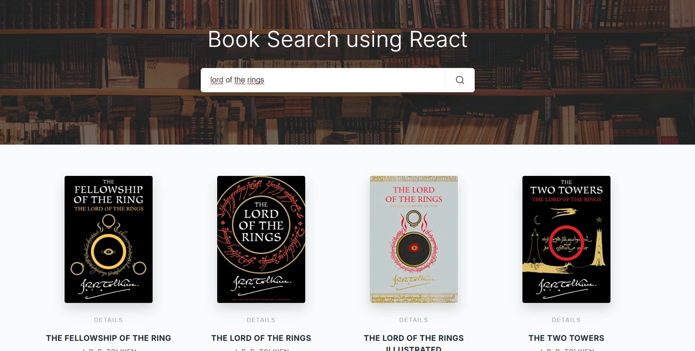

# book-search-app

React • Vite • Axios • iTunes API App

---

[See The Project](https://akbooksearchapp.netlify.app/)

---



---

Bu proje, iTunes API verilerini kullanarak kullanıcıların diledikleri kitap veya yazar ismine göre arama yapabildiği, modern arayüzlü ve dinamik bir kitap keşif uygulamasıdır. Kullanıcı dostu modal yapısı sayesinde kitap detaylarına hızlıca erişim imkanı sunar.

### 🚀 Özellikler

- **Dinamik Arama Sistemi:** Arama çubuğuna girilen ifadeye göre iTunes API (e-book servisi) üzerinden gerçek zamanlı veriler çekilir ve anlık olarak listelenir.
- **Detaylı Bilgi (Modal):** Her kitap kartında bulunan "DETAILS" butonu sayesinde; kitabın büyük boy kapağı, yayın yılı, türü ve açıklama metni gibi bilgilere şık bir modal üzerinden erişilir.
- **Gelişmiş UX:** Arama sırasında aktif olan yüklenme animasyonu (spinner) ve sonuç bulunamadığında gösterilen "Boş Durum" (Empty State) görselleri ile kullanıcı deneyimi optimize edilmiştir.
- **Modern Responsive Tasarım:** Pure CSS kullanılarak hazırlanan ızgara (grid) yapısı, mobil cihazlardan geniş masaüstü ekranlara kadar kusursuz bir uyum sağlar.
- **Performanslı Veri Yönetimi:** Axios ve React Hooks (`useState`) kullanılarak API istekleri ve uygulama durumu (state) modern standartlara göre yönetilir.

### 🛠️ Teknoloji Yığını

- **Frontend:** React (Vite)
- **Styling:** Pure CSS (Modern UI/UX)
- **İkonlar:** Lucide React
- **Veri Kaynağı:** iTunes Search API
- **HTTP Client:** Axios
- **Paket Yöneticisi:** Yarn

### 📋 Gereksinimler

- Node.js (v18+)
- Yarn (v1.22+)

### 🔧 Kurulum ve Çalıştırma

```bash
# Projeyi klonlayın
git clone https://github.com/KULLANICI_ADIN/book-search-app

# Proje klasörüne gidin
cd book-search-app

# Gerekli paketleri (node_modules) yükleyin
yarn install

# Uygulamayı başlatın (Geliştirici ortamı)
yarn dev
```

---

[Frontend Web Development Projeleri](https://academy.patika.dev/courses/frontend-web-development-projeleri/kitap-arama-uygulamasi)

[Patika Profile](https://academy.patika.dev/tr/@alpk)